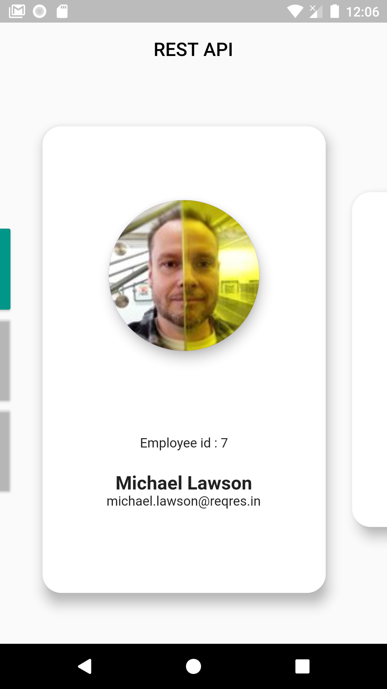
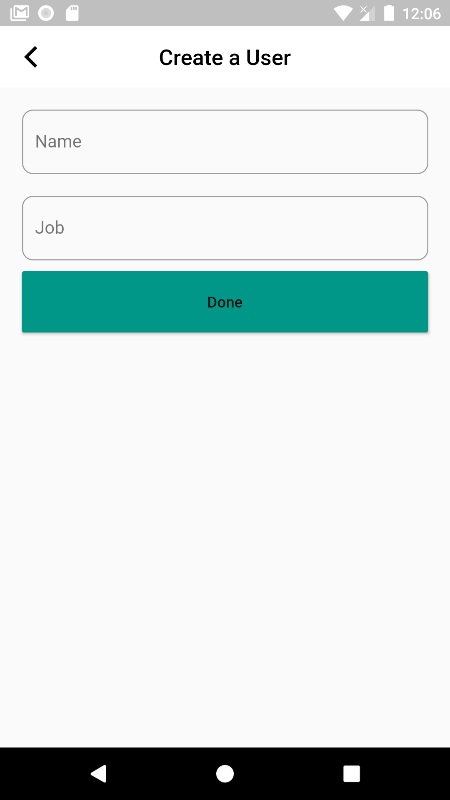
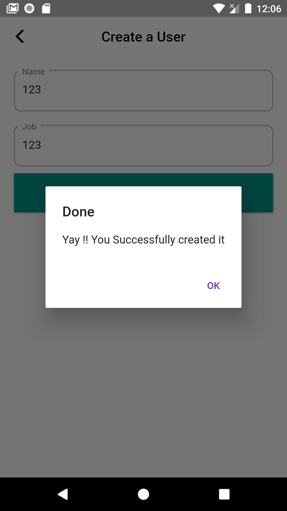

# Http Requests.

    Beginner's First Try to Communicate with the REST API.\n
    Beginner Project.\n
    Messy Code.

Api Used -> [ReqRes](https://reqres.in)

## ScreenShots

<pre>
                    
</pre>

